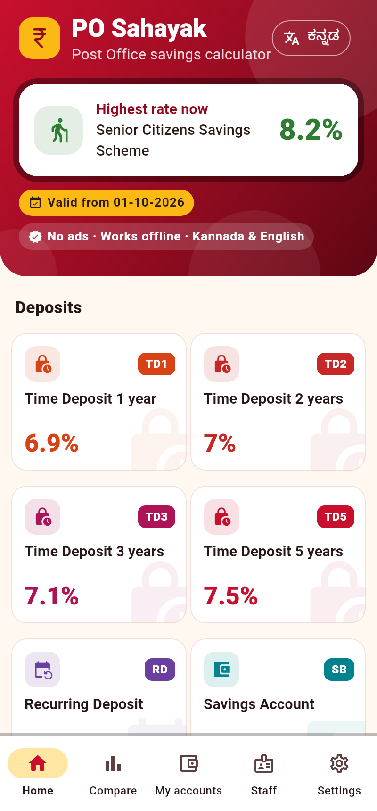
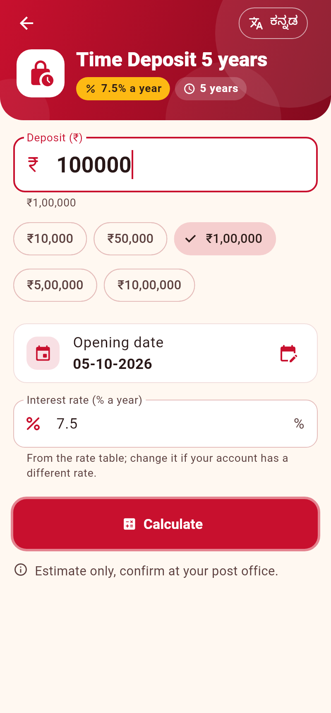
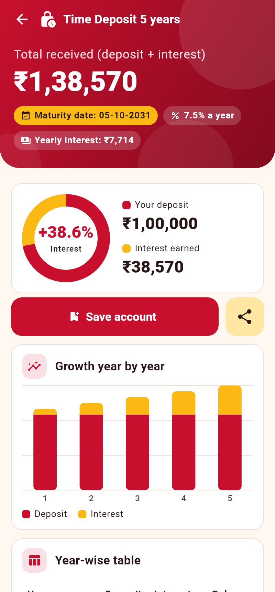
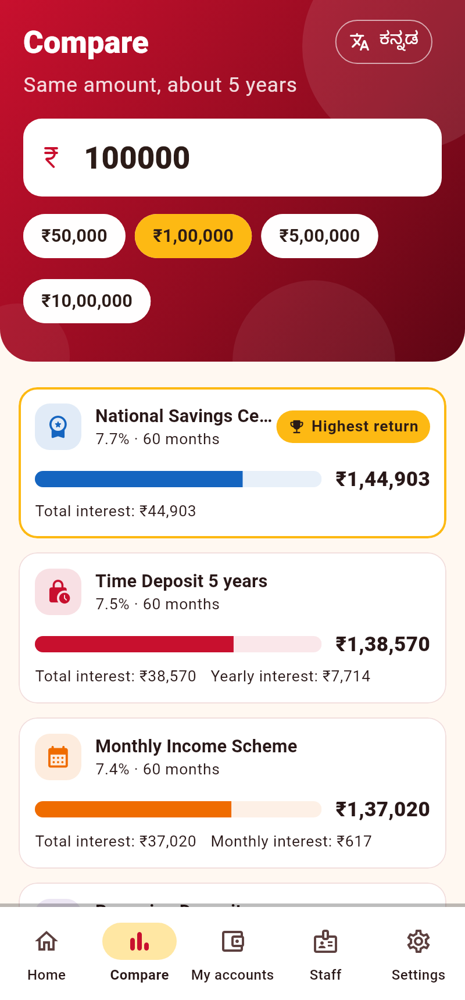
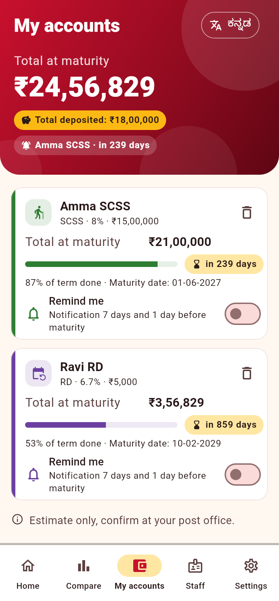
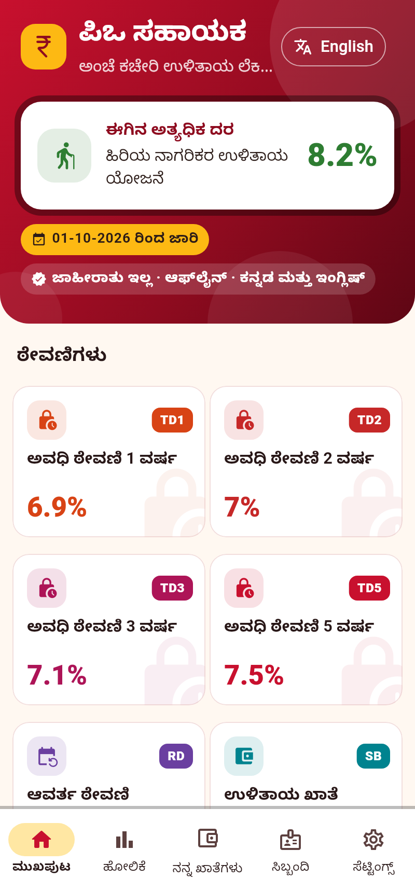

# PO Sahayak

Offline, bilingual (Kannada / English) calculator and helper for Post Office
small savings schemes, for customers, agents and counter staff. Built from
the "PO Sahayak – Claude Code Build Plan" (version 1 scope).

Not affiliated with India Post or the Government of India. Every result is an
estimate; confirm at the post office.

## Screenshots

| Home | Calculator | Result |
| --- | --- | --- |
|  |  |  |
| **Compare** | **My accounts** | **Kannada** |
|  |  |  |

Regenerate with `flutter test tool/screenshots/screenshot_test.dart` (needs
`fonts-noto-core` for Kannada).

## Design

Postal red and yellow (no India Post logo, emblem or name), one colour and
icon per scheme, gradient headers, counting totals, a deposit/interest donut,
year-by-year growth bars, animated compare bars, tenure progress on saved
accounts, staggered entrance animations and fade page transitions. Light and
dark themes.

## What's in version 1

| Screen | What it does |
| --- | --- |
| Home | Scheme tiles with current rates and the "valid from" date, language toggle |
| Calculator | Amount, opening date, rate (from the rate table, editable), limit and age checks |
| Result | Maturity, interest, maturity date, year-wise table, taxable interest per FY, premature closure for any date, PPF/SCSS/RD extensions, PPF/SSY withdrawal limits, save, share card |
| Compare | One amount across TD 5 yr, NSC, KVP, MIS and RD |
| My accounts | Saved accounts, portfolio totals, upcoming maturities, reminders 7 days and 1 day before maturity |
| Staff | Eligibility check (age, limits, single/joint/minor), document checklist, quick calculation with share card |
| Settings | Language, theme, "Not affiliated" notice, rate table version, privacy policy |

Schemes: SB, RD, TD 1/2/3/5, MIS, SCSS, NSC, KVP, PPF, SSY and MSSC (existing
accounts only; it closed to new deposits on 31-03-2025).

## Rules worth knowing

- Money maths uses the `decimal` package only. RD needs a cube root
  (`(1 + r/400)^(1/3)`), computed by Newton's method in Decimal.
- PPF matures after 15 full financial years counted from the end of the FY of
  opening (`ppfMaturity`), not 15 years from the opening date.
- SB, PPF and SSY rates change each quarter for existing accounts, so they are
  projected at today's rate. All other schemes keep the rate on the opening date.
  An extended SCSS account takes the rate on its maturity date.
- 5-year TD opened on or after 09-11-2023: no premature closure before 4 years,
  then SB rate. Opened earlier: 3-year TD rate minus 2%.
- Premature-closure rules marked "verify" in the plan are estimates until they
  are checked against the current POSB rules and SB orders. KVP early-closure
  values are estimated (the official table isn't bundled).

## Rate updates (every quarter)

1. Read the Ministry of Finance notification for the new quarter.
2. In `assets/rates.json`, add a new entry at the top of each scheme whose rate
   changed (`{"from": "YYYY-MM-DD", "rate": x}`), and update `version` and
   `validFrom`.
3. Run `flutter test` (the rate table test lists the expected current rates;
   update it too), bump `version:` in `pubspec.yaml`, and release.

`rates.json` only has rates from 01-01-2024. For older accounts the calculator
asks for the rate from the passbook. Historical rates must be typed in from
the notifications by hand, not generated.

## Build

```sh
flutter pub get
flutter analyze
flutter test
flutter build apk --release --obfuscate --split-debug-info=build/symbols
```

CI (`.github/workflows/po-sahayak.yml`) runs analyze and test, builds the
release APK, checks that the APK has no INTERNET permission, and uploads the
APK as the `po-sahayak-release-apk` artifact.

### Release signing

Create `android/key.properties` (never commit it):

```properties
storeFile=/path/to/upload-keystore.jks
storePassword=...
keyAlias=upload
keyPassword=...
```

Without it, release builds are signed with the debug key: fine for installing
and testing, not for the Play Store. For Play, build an app bundle with
`flutter build appbundle --release --obfuscate --split-debug-info=build/symbols`
and keep the symbols to read crash traces.

## Differences from the build plan

- Saved accounts are stored as JSON in `shared_preferences`, not `drift`
  (no SQLite or code generation for a short list of accounts).
- Plain `Navigator` and `ChangeNotifier` instead of Riverpod and go_router,
  matching the other Flutter app in this repo.
- Strings live in `lib/app/strings.dart` (English + Kannada side by side)
  instead of `.arb` files.
- Kannada text uses the phone's built-in Noto Sans Kannada; no font is bundled.
- "Add to calendar" and the RD default-fee calculator are not built yet.
- Form filler and goal planner are version 2.
