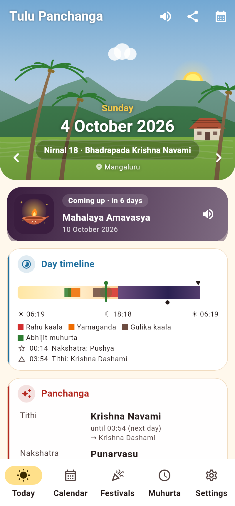
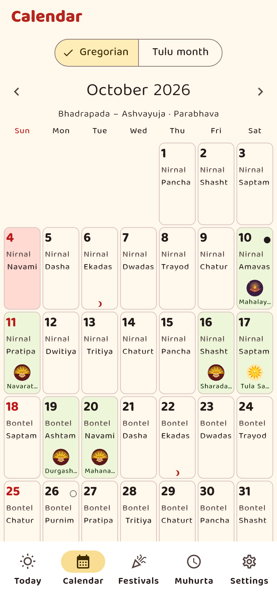
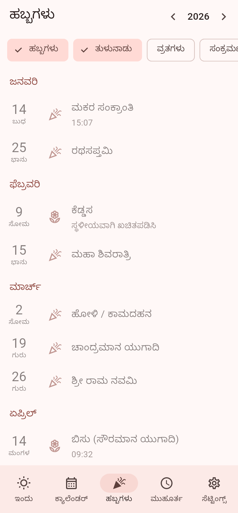
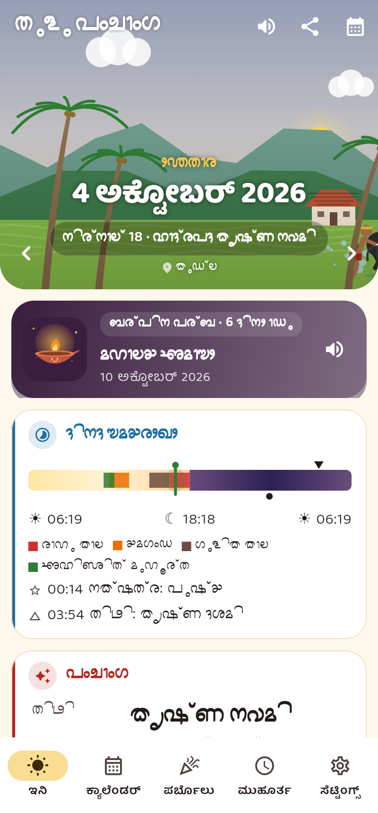

# Tulu Panchanga (ತುಳು ಪಂಚಾಂಗ)

An offline Tulu calendar and panchanga for Android, built with Flutter.
Everything is computed on the phone; there is no network access.

<p>




</p>

**Download:** [tulu-panchanga.apk](https://github.com/maheshraikg/Pdf_Tools/releases/download/tulu-panchanga-latest/tulu-panchanga.apk)
(latest build from CI, debug-signed).

## Features

- **Today**: weekday, Gregorian, Tulu (solar) and lunar date; a **timeline
  bar** for sunrise → next sunrise with Rahu kaala, Yamaganda, Gulika,
  Abhijit, tithi and nakshatra changes and a "now" marker; tithi,
  nakshatra, yoga and karana with end times; sunrise, sunset, moonrise and
  moonset; festivals of the day. Swipe or use the arrows to change day.
- **Day detail**: everything above plus moon sign, sun sign, pada,
  samvatsara (Chandramana and Sauramana), Shaka/Kali year, ayana, ritu,
  sankramana time, Brahma muhurta and durmuhurta.
- **Calendar**: Gregorian month grid, or a **Tulu month** grid (Paggu …
  Suggi) with Gregorian dates in each cell; festivals, purnima/amavasya and
  ekadashi marked.
- **Festivals**: a year list of Tulunadu and Karnataka festivals,
  sankramanas and vratas (Ekadashi, Sankashti, Pradosha, Purnima,
  Amavasya), filterable by category. Each festival shows the rule used.
- **Muhurta helper**: shortlists daytime windows for six activities, with
  optional tarabala/chandrabala from your birth star/rashi.
- **Notifications**: optional morning panchanga, a festival reminder the
  evening before, and a Rahu-kaala alert.
- **Home-screen widget**: today's Tulu date, tithi, nakshatra, sunrise and
  festival/Rahu kaala.
- **Share card**: shares the day as an image and text.
- **Languages**: English, Kannada and Tulu (Kannada script), with a
  **Tulu-lipi toggle** that renders Tulu text in Tulu-Tigalari script
  (Mallige font).
- **Locations**: 13 presets (Mangaluru, Udupi, Kundapura, Karkala,
  Moodbidri, Puttur, Bantwal, Belthangady, Sullia, Kasaragod, Bengaluru,
  Mumbai, Dubai) or any latitude/longitude/UTC offset.

## Accuracy and conventions

| Component | Method | Checked against Swiss Ephemeris |
|---|---|---|
| Sun | VSOP87D (Earth), truncated at 5×10⁻⁸ rad | ≤ 0.3″, 1950–2100 |
| Moon | Meeus ch. 47 (ELP-2000/82 truncated) | ≤ 20″ |
| Ayanamsa | Lahiri (SE `SIDM_LAHIRI`, mean) | < 0.001″ |
| ΔT | SE-matched table 2000–2100, Espenak–Meeus outside | — |
| Tithi / sankramana instants | Newton search | < 1 min (2026–27) |
| Sunrise / sunset, Mangaluru | iterative hour angle | < 30 s (in practice < 2 s) |
| Moonrise | altitude scan + bisection | < 2 min |

Conventions that vary between panchangas (sunrise definition, the day-1
rule for Tulu months, the tie rule for festivals) are settings. The full
list, festival rules, and what still needs a priest's confirmation are in
**[docs/VERIFY.md](docs/VERIFY.md)**.

## Build

Requires Flutter stable (3.47+, Dart 3.13+), JDK 17 and the Android SDK.

```sh
cd tulu_panchanga
flutter pub get
flutter analyze
flutter test                     # astronomy, panchanga, festival, muhurta, names, widgets
flutter build apk --release      # build/app/outputs/flutter-apk/app-release.apk
```

The release build uses `android/key.properties` (storeFile, storePassword,
keyAlias, keyPassword) when present, else the debug key.

CI (`.github/workflows/tulu-panchanga.yml`) runs analyze and tests, exports
the Mangaluru CSVs for the current and next year, builds the release APK and
uploads both as artifacts. Builds of `master` (and manual runs) also publish
the APK to the rolling `tulu-panchanga-latest` pre-release, which gives the
direct download link above.

## Tools

```sh
# Daily panchanga + festival verification sheet as CSV
dart run tool/export_csv.dart --year 2026 --place mangaluru --out docs/csv \
    [--sunrise upperLimb|discCentre] [--month-rule sunset|aparahna|nextDay]

# Regenerate astronomy tables / Swiss Ephemeris fixtures (needs Python)
pip install pymeeus pyswisseph
python tool/gen_tables.py > lib/astro/tables.dart
python tool/gen_reference.py

# Screenshots for review (needs fonts-noto-core for Kannada)
flutter test tool/screenshots/screenshot_test.dart

# Rough AOT timing
dart compile exe tool/bench.dart -o /tmp/bench && /tmp/bench
```

`docs/csv/` holds the 2026 and 2027 Mangaluru exports. The festival CSV has
blank `priest_date` / `priest_comment` columns for verification.

## Performance

Measured AOT on the build machine: one day ≈ 2–3 ms, a 42-day month ≈ 95 ms,
a festival year ≈ 0.6 s, a 90-day muhurta search ≈ 125 ms. Months, festival
years, muhurta searches and notification/widget data run in a background
isolate; single days are computed on the UI thread and cached.

## Project layout

```
lib/astro/            astronomy (VSOP87 Sun, Meeus Moon, rise/set, search)
lib/panchanga/        engine (day panchanga, months), festivals, muhurta, names, places
lib/lipi/             Kannada → Tulu-Tigalari
lib/app/              settings, strings (en/kn/tcy), repo (isolates), notifications + widget
lib/screens/          Today, day detail, timeline, calendar, festivals, muhurta, settings, share card
android/…/TodayWidgetProvider.kt   home-screen widget
tool/                 CSV export, table/fixture generators, icon, screenshots, bench
docs/                 VERIFY.md, CSVs, screenshots
```

## Roadmap

- Jataka (birth chart) basics: lagna, graha positions, rashi chart.
- Choghadiya as an option alongside Rahu kaala.
- More muhurta presets (e.g. upanayana, marriage, aksharabhyasa,
  seemantha, annaprashana, vehicle/land registration), with Varjyam and
  Amrita kaala.
- iOS build (widget via WidgetKit, notifications).
- Tulu-language audio for the daily panchanga.

## Licences

Code: as the repository. Tulu-Tigalari font: Mallige v1.4, SIL OFL 1.1
(`assets/fonts/OFL.txt`). VSOP87 and ELP/Meeus coefficient tables are
published scientific data.
