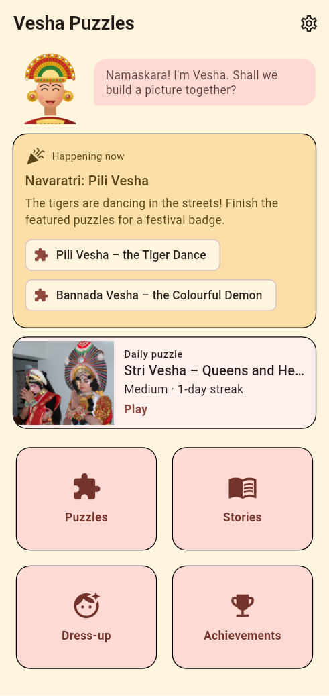
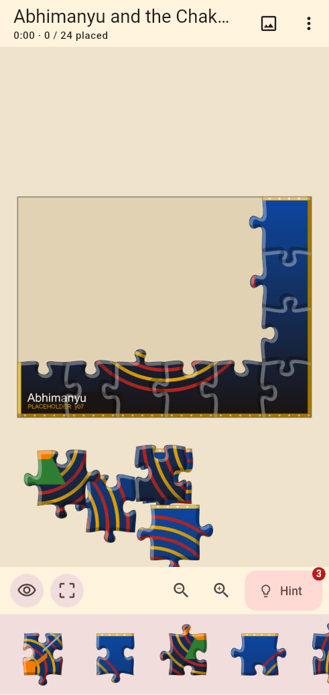
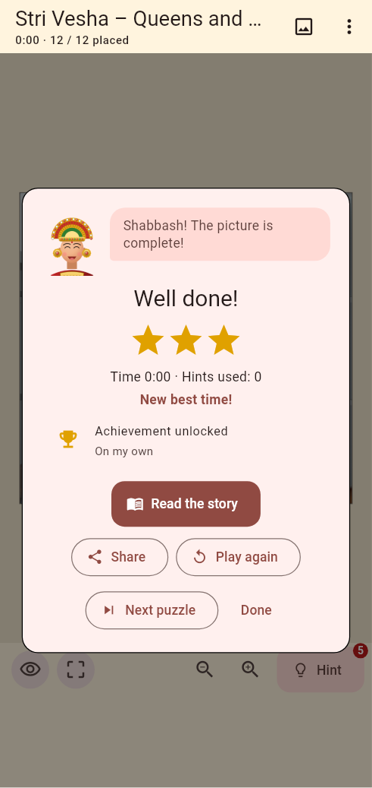
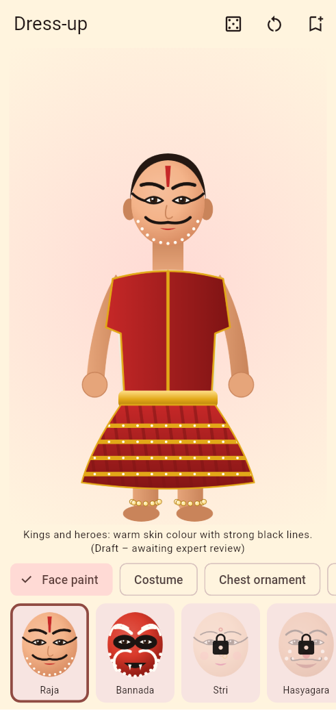

# Vesha Puzzles (ವೇಷ ಪಝಲ್)

Jigsaw puzzles, short stories and a Yakshagana dress-up for children and
families, built with Flutter for Android. Offline, no account, no
tracking; English, Kannada and Tulu (Kannada script).

<p>




</p>

> **Puzzle pictures are freely licensed photos from Wikimedia Commons**
> (credited in the app; fetched with `tool/fetch_photos.dart`). Dress-up
> layers and the Vesha guide are vector illustrations drawn by
> `tool/art/draw_art_test.dart`; sounds are generated placeholders. AI
> versions can be made with `tool/gen_ai_images.dart` (needs a Gemini API
> key). The art to commission is in [docs/ART_GUIDE.md](docs/ART_GUIDE.md);
> stories and cultural notes await expert review — see
> [docs/CONTENT_TO_REVIEW.md](docs/CONTENT_TO_REVIEW.md).

## Features

- **Jigsaw engine** – classic knob-and-hole pieces generated from a seed;
  4 difficulties (≈12/24/48/80 pieces, grid chosen for square pieces);
  pieces snap to the frame and to each other and move as groups;
  pinch-zoom, pan, double-tap to fit; piece tray with an edge-pieces
  filter; drag a piece up from the tray or tap it to drop it near the
  frame; double-tap a loose piece to send it back. Pieces are pre-rendered
  to GPU images (≤ 24 MB) so dragging stays smooth at 80 pieces.
- **Puzzle flow** – difficulty picker with piece counts and best times,
  hints (5 on Easy, 3 otherwise; places a piece next to placed ones),
  faint-picture toggle, preview, autosave and resume, completion with
  stars, best time, confetti, unlocked achievements and **share** (image
  + text).
- **Stories** – each puzzle unlocks a short story with a "Did you know?"
  fact; drafts show an "awaiting expert review" label.
- **Vesha, the guide** – a young performer who greets, gives tips and
  cheers.
- **Library** – packs (Yakshagana: 8, Karavali Utsava: 4); first three
  puzzles of a pack are open, the rest unlock one by one.
- **Dress-up** – 7 layer slots (face paint, costume, chest, shoulders,
  ears, headgear, prop); some options unlock with puzzles; random look,
  save and share.
- **Daily puzzle** – the same picture, cut and difficulty for everyone on
  a date; streaks.
- **Progress & achievements** – 14 achievements, stats.
- **Events** – date windows (Navaratri pili vesha, Deepavali, start of the
  Yakshagana season, Bisu) highlight puzzles and award a badge. Dates for
  2026–27 come from the repository's Tulu Panchanga CSVs.
- **Audio** – sound effects and an optional music loop; vibration.
- **Settings** – language, sound, music, volume, vibration, faint
  picture, reduce motion, theme, guide tips, reset; credits & licences.
- **Ads / IAP** – compile-time flags, off by default, no SDKs included
  (see [docs/MONETIZATION.md](docs/MONETIZATION.md)).

## Build

Requires Flutter stable (3.47+, Dart 3.13+), JDK 17 and the Android SDK.

```sh
cd vesha_puzzles
flutter pub get
flutter analyze
flutter test                     # engine, content, game logic, widgets, perf
flutter build apk --release      # build/app/outputs/flutter-apk/app-release.apk
```

The release build uses `android/key.properties` (storeFile,
storePassword, keyAlias, keyPassword) when present, else the debug key.
CI (`.github/workflows/vesha-puzzles.yml`) runs analyze and tests, builds
the release APK and uploads it as an artifact.

## Content and art packs

```
assets/packs/index.json            list of pack ids, in display order
assets/packs/<id>/pack.json        title, description, credits, puzzles
assets/packs/<id>/images/*.jpg     puzzle pictures (4:3)
assets/content/stories.json        stories (en/kn/tcy) with review status
assets/content/guide.json          Vesha's lines and images
assets/content/events.json         event date windows and featured puzzles
assets/dressup/dressup.json        slots, options, unlocks
assets/dressup/layers/**.png       transparent layers on one canvas
assets/audio/*.wav                 sound effects and music loop
```

The loader checks every referenced file; a missing picture skips only
that puzzle (and is logged), so a half-delivered pack still runs. To add a
pack: create the folder, add its id to `index.json`, list the folder (and
its `images/`) under `assets:` in `pubspec.yaml`.

## Tools

| Command | What it does |
|---|---|
| `dart run tool/gen_placeholders.dart [--force]` | Creates any missing placeholder picture, launcher icon or sound (`--force` overwrites). |
| `flutter test tool/art/draw_art_test.dart` | Redraws the dress-up layers (1024×1536) and Vesha guide portraits. |
| `dart run tool/fetch_photos.dart` | Replaces puzzle pictures with CC/PD photos from Wikimedia Commons (licence checked) and writes credits (also run by `.github/workflows/vesha-photos.yml`). |
| `GEMINI_API_KEY=… dart run tool/gen_ai_images.dart` | Generates puzzle pictures and guide portraits with Imagen (also `.github/workflows/vesha-ai-images.yml`). |
| `dart run tool/gen_review_doc.dart` | Rebuilds `docs/CONTENT_TO_REVIEW.md` from the content JSON and Tulu strings. |
| `flutter test tool/screenshots/screenshot_test.dart` | Renders screenshots to `docs/screenshots/` (needs `fonts-noto-core`). |

## Code map

```
lib/jigsaw/   cut.dart (grid + tabs), piece_path.dart, board.dart (groups,
              snapping, hints, save format), piece_cache.dart,
              controller.dart (viewport, drag, tray), board_view.dart
lib/packs/    content model and loader
lib/game/     progress, achievements, daily, saves, audio
lib/screens/  home, library, difficulty, puzzle (+completion), stories,
              dress-up, progress, settings, credits
lib/monetization/  flags, no-op ads/IAP services
```

## Roadmap

- **Match-3 mode** using vesha icons (Flame engine).
- **Story read-aloud** in Kannada and Tulu (recorded narration).
- **Multiplayer "race to finish"** on the same daily cut.
- **iOS** build.
- **More packs**: Kambala, Bhoota Kola (respectful scenes, made with
  community guidance), Mysuru Dasara.
